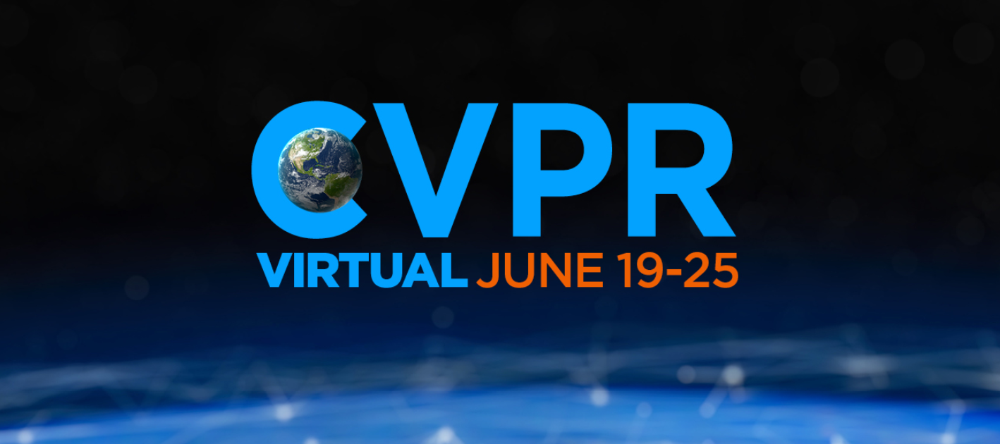
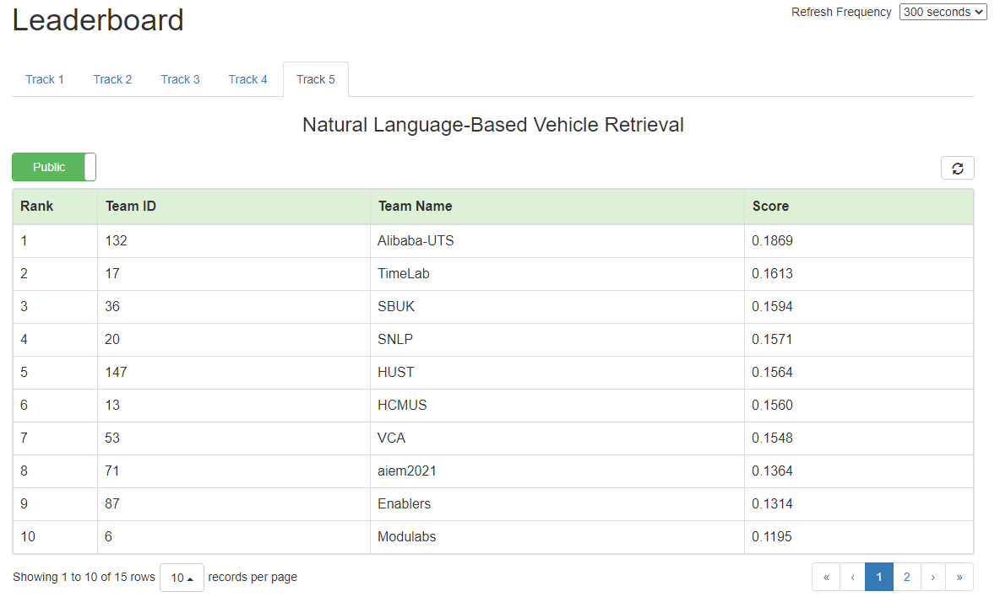

# [CVPR 2021 Challenge](https://www.aicitychallenge.org/)  

## Track 5: Natural Language-Based Vehicle Retrieval

## Overview

- This is the code for the #5 solution
- The [single model](https://drive.google.com/file/d/1-2-rGO46ZXVS0GTxxx-LlyVe_RU3aumu/view?usp=sharing) achieved 0.1564 MRR in the private leaderboard

## Prerequisites

- torch
- torchvision
- numpy
- pandas
- sklearn
- opencv-python
- efficientnet_pytorch
- transformers
- albumentations
- tqdm
- timm
- textdistance
- openai/CLIP

Running `setup.sh` also installs the dependencies

## Reproceduring

- Running [run_nce.py](src/run_nce.py) with the default arguments
